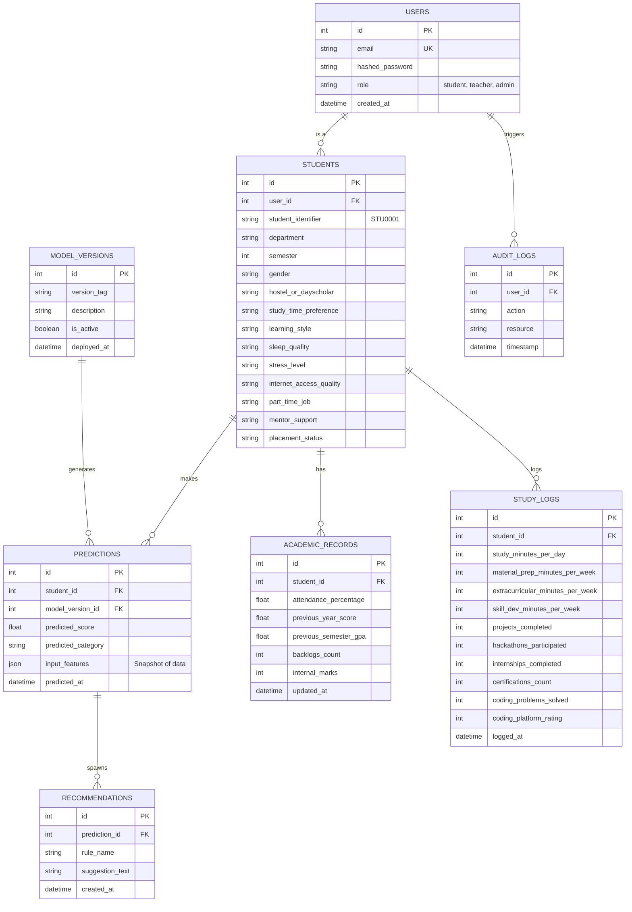

# Backend Schema and API Contract
**Project Name:** EduMetrics ML (Student Performance Analysis)
**Phase:** 6

## 1. Entity-Relationship (ER) Diagram

## 2. Table Definitions (SQL/ORM Mapping)

### Users
- `id` (Integer, Primary Key)
- `email` (String, Unique, Index)
- `hashed_password` (String)
- `role` (Enum: student, teacher, admin)
- `created_at` (DateTime, Default: now)

### Students
- `id` (Integer, Primary Key)
- `user_id` (Integer, ForeignKey to `Users.id`, Unique)
- `student_identifier` (String, Index, e.g., 'STU0001')
- Demographic/Behavioral categorical columns directly matching Phase 1 Dataset.

### Academic_Records
- `id` (Integer, Primary Key)
- `student_id` (Integer, ForeignKey to `Students.id`)
- Numeric columns matching Phase 1 Dataset (`attendance_percentage`, `previous_year_score`, etc.)

### Study_Logs
- `id` (Integer, Primary Key)
- `student_id` (Integer, ForeignKey to `Students.id`)
- Integer columns tracking time (in minutes) and activity counts from Phase 1.

### Predictions
- `id` (Integer, Primary Key)
- `student_id` (Integer, ForeignKey to `Students.id`, Index)
- `model_version_id` (Integer, ForeignKey to `Model_Versions.id`)
- `predicted_score` (Float)
- `predicted_category` (String)
- `input_features` (JSON, preserves exact state at time of prediction)
- `predicted_at` (DateTime, Default: now)

### Model_Versions
- `id` (Integer, Primary Key)
- `version_tag` (String, Unique)
- `description` (String)
- `is_active` (Boolean, Default: True)
- `deployed_at` (DateTime)

## 3. REST API Contract

### Authentication
**POST `/api/v1/auth/login`**
- **Req:** `{"email": "...", "password": "..."}`
- **Res:** `200 OK` `{"access_token": "ey...", "token_type": "bearer", "role": "student"}`
- **Auth:** Public

### Student Profiles
**GET `/api/v1/students/me`**
- **Req:** None (Uses Token)
- **Res:** `200 OK` Returns combined JSON of `Students`, `Academic_Records`, and `Study_Logs`.
- **Auth:** Student

**PUT `/api/v1/students/me`**
- **Req:** JSON matching Demographics, Academics, and Activities schema.
- **Res:** `200 OK` `{"message": "Profile updated"}`
- **Auth:** Student

### Predictions (Inference)
**POST `/api/v1/predict/single`**
- **Req:** Combined JSON payload containing all necessary features (derived from profile state + form overrides).
- **Res:** `200 OK` `{"prediction_id": 102, "predicted_score": 82.5, "predicted_category": "Good", "recommendations": [...]}`
- **Auth:** Student, Teacher

**GET `/api/v1/predict/history`**
- **Req:** `?limit=10`
- **Res:** `200 OK` `[{"predicted_score": 82.5, "predicted_at": "2026-09-20T..."}, ...]`
- **Auth:** Student

### Teacher Dashboard
**GET `/api/v1/analytics/class`**
- **Req:** `?department=CSE&semester=6`
- **Res:** `200 OK` `{"total": 120, "at_risk": 15, "students": [...]}`
- **Auth:** Teacher, Admin
