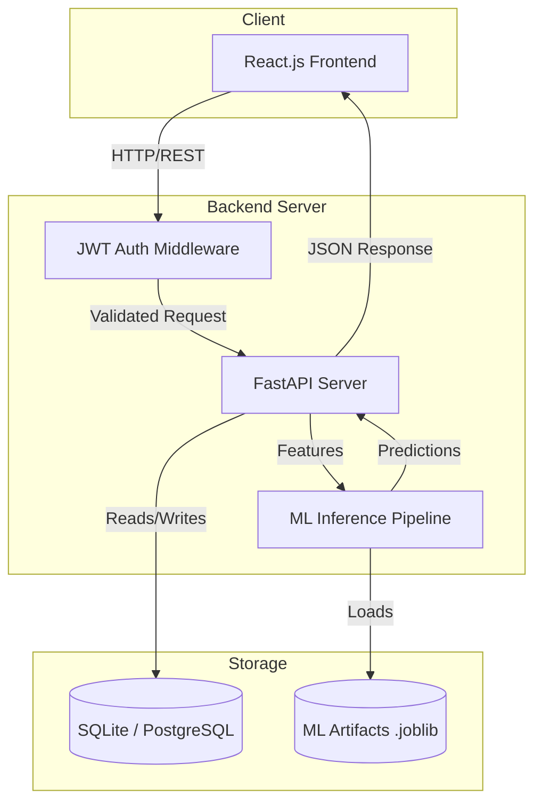

# Technical Requirements Document (TRD)
**Project Name:** EduMetrics ML (Student Performance Analysis)
**Phase:** 4

## 1. System Architecture
The application follows a standard three-tier architecture: a React Single Page Application (SPA) frontend, a Python FastAPI backend, and an SQLite database (PostgreSQL for production). The ML Inference module is embedded within the backend to serve predictions in real-time.



## 2. Tech Stack & Justifications
- **Frontend:** `React 19` + `Vite` (Fast build times, component reusability). `Tailwind CSS v4` (Utility-first, rapid responsive styling).
- **Backend:** `Python 3.11` + `FastAPI` (High performance, async support, auto-generated OpenAPI docs).
- **Machine Learning:** `scikit-learn` (Pipelines, Linear/Logistic regression models), `pandas` (data manipulation).
- **Database:** `SQLite` for local development, easily migrating to `PostgreSQL` for production via SQLAlchemy.
- **Deployment (Planned):** `Docker` (containerization for consistency) and `GitHub Actions` (CI/CD).

## 3. Component Breakdown
- **Web App (Frontend):** 
  - `Pages:` Login, Dashboard, Prediction Form, What-If Simulator, History.
  - `Services:` Axios/Fetch wrappers for API communication.
  - `State Management:` React Context or standard `useState` hooks for form tracking.
- **API Server (Backend):**
  - `Routers:` `/auth`, `/students`, `/predict`, `/analytics`.
  - `Services:` ML inference service, DB CRUD operations.
  - `Schemas:` Pydantic models for strict input validation.

## 4. ML Serving Design
The ML models (Linear Regression for score, Logistic Regression for category) and the LabelEncoder are pre-trained and saved as `.joblib` files. 
- During FastAPI `startup`, the `.joblib` files are loaded into memory once.
- The `/predict` endpoint receives JSON data, converts it to a pandas DataFrame, and passes it through the scikit-learn Pipeline (which handles imputation and scaling automatically).
- Latency is expected to be under 100ms since the model resides in memory.

## 5. API Design Overview (RESTful)
- `POST /api/v1/auth/login` - Returns JWT token.
- `POST /api/v1/predict/single` - Accepts student metrics, returns score, category, and saves to DB.
- `POST /api/v1/predict/batch` - Accepts CSV, returns augmented CSV.
- `GET /api/v1/students/{id}/history` - Returns previous predictions for trend analysis.
- `GET /api/v1/analytics/class` - Returns aggregated stats for the Teacher dashboard.

## 6. Data Flow Example (Prediction)
1. User enters data (e.g., Study Time: 2 Hours 30 Mins) on the React Form.
2. Frontend converts "2 Hours 30 Mins" -> `150` minutes.
3. Frontend sends POST request to `/api/v1/predict/single` with JWT token.
4. FastAPI validates token and Pydantic schema.
5. FastAPI passes `150` minutes (along with other features) to the in-memory ML pipeline.
6. Pipeline outputs predicted score (e.g., `82.4`) and category (`Good`).
7. FastAPI saves the input and output to the `predictions` table in the DB.
8. FastAPI responds with HTTP 200 and the JSON prediction payload.
9. React displays the result and updates the "What-If" charts.

## 7. Security
- **Authentication:** JWT (JSON Web Tokens) with a 2-hour expiration.
- **Authorization:** Role-Based Access Control (RBAC) via FastAPI dependencies (`is_student`, `is_teacher`).
- **Passwords:** Hashed using `bcrypt` (Passlib).
- **CORS:** Restricted to the frontend domain in production.

## 8. Performance & Scalability
- **Backend:** FastAPI's asynchronous capabilities (`async def`) will be used for DB I/O to handle concurrent requests efficiently.
- **Database:** Indexes will be created on `student_id` and `timestamp` for fast retrieval of historical logs.
- **Scale:** The stateless API design allows horizontal scaling via Docker containers behind a load balancer.

## 9. Logging, Monitoring & Error Handling
- **Logging:** Python's standard `logging` library formatting logs to standard output.
- **Error Handling:** Global exception handlers in FastAPI to catch validation errors (Pydantic `ValidationError`) and return standardized JSON error messages (e.g., `{"error": "Invalid time format"}`).

## 10. Testing Strategy
- **Backend:** `pytest` for unit testing ML loading, DB CRUD, and endpoint integration. Target >80% coverage.
- **Frontend:** Component testing (optional/TBD) and manual E2E flows.
- **ML:** Data drift and schema validation tests to ensure incoming API data matches training data bounds.

## 11. Folder Structure Definition
```text
Project Root
├── data/              # Raw and processed datasets, generation scripts
├── ml/                # Training scripts, evaluation, .joblib artifacts
├── notebooks/         # EDA and experimentation
├── backend/           # FastAPI application
│   ├── app/
│   │   ├── api/       # Route handlers
│   │   ├── core/      # Config, security
│   │   ├── models/    # SQLAlchemy models
│   │   ├── schemas/   # Pydantic models
│   │   └── services/  # ML inference logic
├── frontend/          # React.js application
│   ├── src/
│   │   ├── components/# Reusable UI (Navbar, Inputs)
│   │   ├── pages/     # Views (Dashboard, Form)
│   │   └── services/  # API clients
├── tests/             # Pytest suite
└── docs/              # PRD, TRD, UI/UX, Data Dictionary
```
